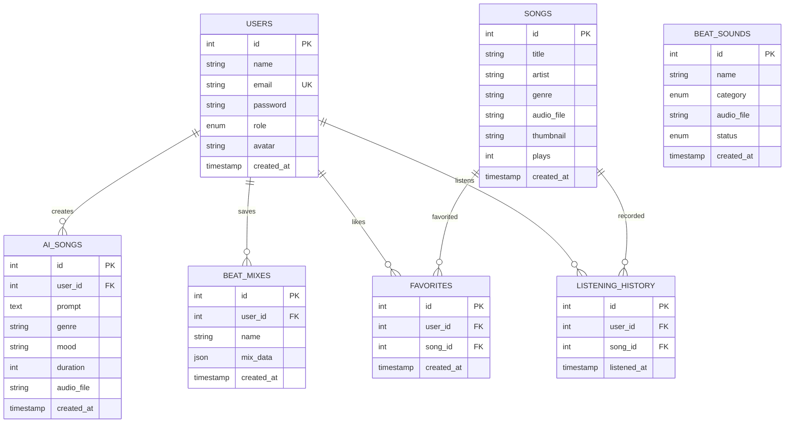
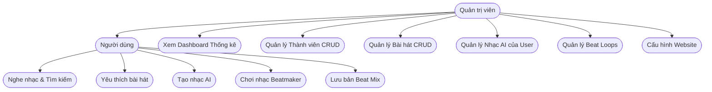
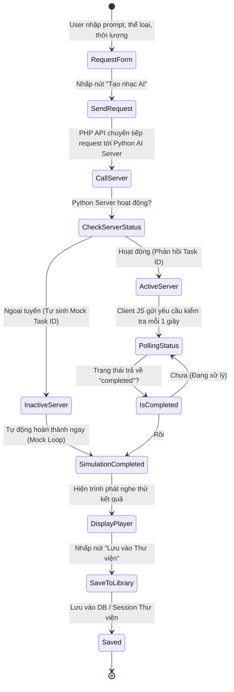
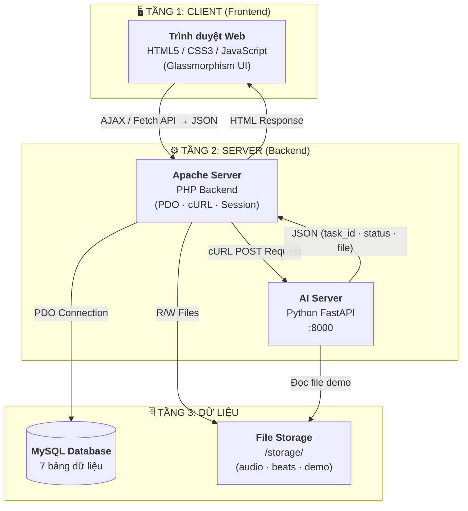
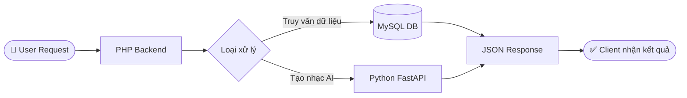

# Tài Liệu Thiết Kế Hệ Thống MusicAI

Tài liệu này mô tả các sơ đồ luồng hoạt động, cấu trúc cơ sở dữ liệu và kiến trúc tổng quan của dự án MusicAI.

---

## 1. Sơ đồ Thực thể Liên kết (Entity-Relationship Diagram - ERD)

Sơ đồ ERD mô tả mối quan hệ giữa các bảng trong cơ sở dữ liệu MySQL:

---

## 2. Sơ đồ Ca sử dụng (Use Case Diagram)

Phân chia các quyền hạn chức năng giữa **Người dùng thông thường** và **Quản trị viên (Admin)**:

---

## 3. Sơ đồ Luồng hoạt động Tạo nhạc AI (Activity Diagram)

Mô tả luồng xử lý từ khi người dùng gửi mô tả prompt cho đến khi nhận được tệp nhạc AI từ server (có cơ chế dự phòng tự động khi AI Server offline):

---

## 4. Sơ đồ Kiến trúc Hệ thống (Architecture Diagram)

Mô tả kiến trúc **3 tầng** của hệ thống: Tầng Giao diện (Client), Tầng Xử lý (Server), và Tầng Dữ liệu & AI. Các thành phần giao tiếp qua REST API trả JSON, PDO cho Database, và cURL cho AI Server.

### Luồng xử lý Request tổng quát

