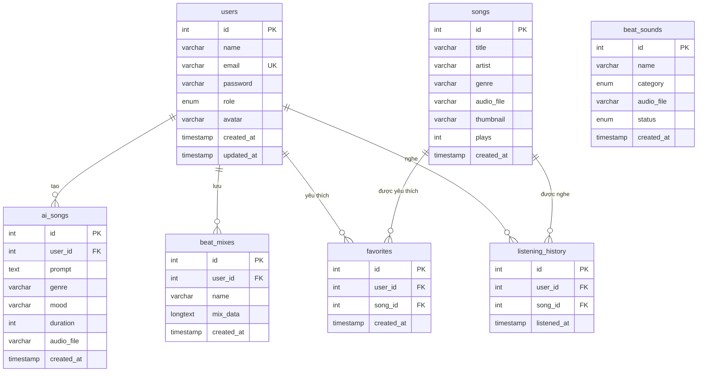
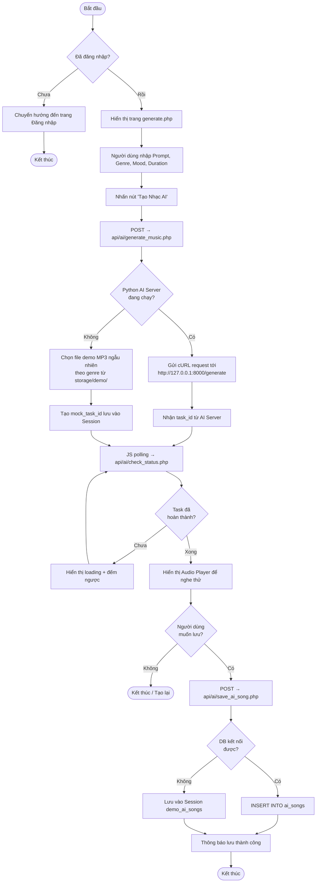
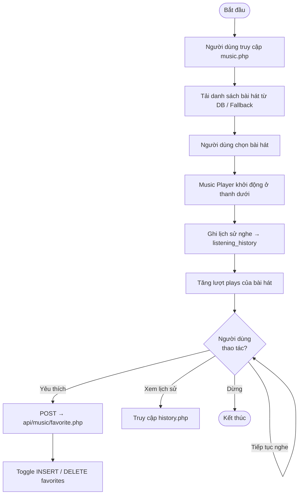
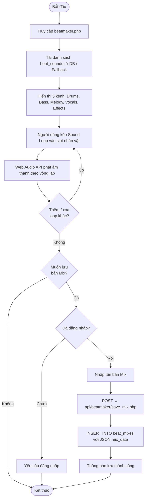

# Tài Liệu Thiết Kế Hệ Thống — MusicAI
*** Thầy có thể sử dụng để xem các sơ đồ hệ thống trên phần mềm mermaid ***

> Tài liệu mô tả kiến trúc tổng thể, sơ đồ thực thể quan hệ (ERD), biểu đồ Use Case, Activity Diagram và luồng hoạt động của hệ thống MusicAI.

---

## 1. Kiến Trúc Hệ Thống (System Architecture)

```
┌─────────────────────────────────────────────────────────────────┐
│                        TRÌNH DUYỆT (Browser)                    │
│           HTML5 / CSS3 / JavaScript (Vanilla)                   │
│     Glassmorphism UI · Neon Green Theme · Web Audio API         │
└────────────────────────┬────────────────────────────────────────┘
                         │  HTTP Request / AJAX (fetch / XMLHttpRequest)
                         ▼
┌─────────────────────────────────────────────────────────────────┐
│                   WEB SERVER — Apache (XAMPP)                   │
│                    PHP 8.0 · PDO · Session                      │
│                                                                 │
│  ┌──────────────┐  ┌───────────────┐  ┌──────────────────────┐  │
│  │  Pages (.php)│  │  API (/api/*) │  │  Admin (/admin/*)    │  │
│  │  index.php   │  │  auth/        │  │  dashboard.php       │  │
│  │  music.php   │  │  music/       │  │  songs.php           │  │
│  │  generate.php│  │  ai/          │  │  users.php           │  │
│  │  beatmaker   │  │  beatmaker/   │  │  ai_music.php        │  │
│  │  library.php │  │  user/        │  │  beats.php           │  │
│  └──────────────┘  └───────────────┘  └──────────────────────┘  │
└───────────┬─────────────────────┬───────────────────────────────┘
            │  PDO (MySQL)        │  cURL (HTTP POST JSON)
            ▼                     ▼
┌───────────────────┐   ┌────────────────────────────────────────┐
│  MySQL Database   │   │       Python AI Server (FastAPI)       │
│  music_ai         │   │       ai-server/main.py                │
│                   │   │       http://127.0.0.1:8000            │
│  · users          │   │                                        │
│  · songs          │   │  POST /generate  → Mô phỏng tạo nhạc   │
│  · ai_songs       │   │  GET  /status    → Kiểm tra tiến độ    │
│  · beat_mixes     │   │  GET  /health    → Kiểm tra hoạt động  │
│  · beat_sounds    │   │                                        │
│  · favorites      │   │  [Fallback Mode]: Nếu server AI chưa   │
│  · listening_     │   │  khởi chạy, PHP tự động dùng file      │
│    history        │   │  demo MP3 có sẵn trong storage/demo/   │
└───────────────────┘   └────────────────────────────────────────┘
```

---

## 2. Sơ Đồ Thực Thể Quan Hệ — ERD (Entity Relationship Diagram)



---

## 3. Biểu Đồ Use Case

```mermaid
graph TD
    Guest["👤 Khách (Guest)"]
    User["👤 Người Dùng (User)"]
    Admin["👤 Quản Trị Viên (Admin)"]

    subgraph MusicAI_System["🎵 Hệ Thống MusicAI"]
        UC1["Xem trang chủ & danh sách nhạc"]
        UC2["Nghe nhạc (Music Player)"]
        UC3["Tìm kiếm & lọc theo thể loại"]
        UC4["Đăng ký tài khoản"]
        UC5["Đăng nhập"]
        UC6["Tạo nhạc AI bằng Prompt"]
        UC7["Lưu nhạc AI vào thư viện"]
        UC8["Sử dụng Beatmaker Studio"]
        UC9["Lưu bản Beat Mix"]
        UC10["Quản lý danh sách yêu thích"]
        UC11["Xem lịch sử nghe nhạc"]
        UC12["Cập nhật hồ sơ & ảnh đại diện"]
        UC13["Quản lý người dùng (CRUD)"]
        UC14["Upload bài hát mới"]
        UC15["Quản lý nhạc AI & Beat Mix"]
        UC16["Cấu hình hệ thống"]
    end

    Guest --> UC1
    Guest --> UC2
    Guest --> UC3
    Guest --> UC4
    Guest --> UC5

    User --> UC1
    User --> UC2
    User --> UC3
    User --> UC6
    User --> UC7
    User --> UC8
    User --> UC9
    User --> UC10
    User --> UC11
    User --> UC12

    Admin --> UC13
    Admin --> UC14
    Admin --> UC15
    Admin --> UC16
    Admin --> UC1
    Admin --> UC2
```



---

## 4. Activity Diagram — Luồng Tạo Nhạc AI



---

## 5. Activity Diagram — Luồng Nghe Nhạc & Tương Tác



---

## 6. Activity Diagram — Luồng Beatmaker Studio

